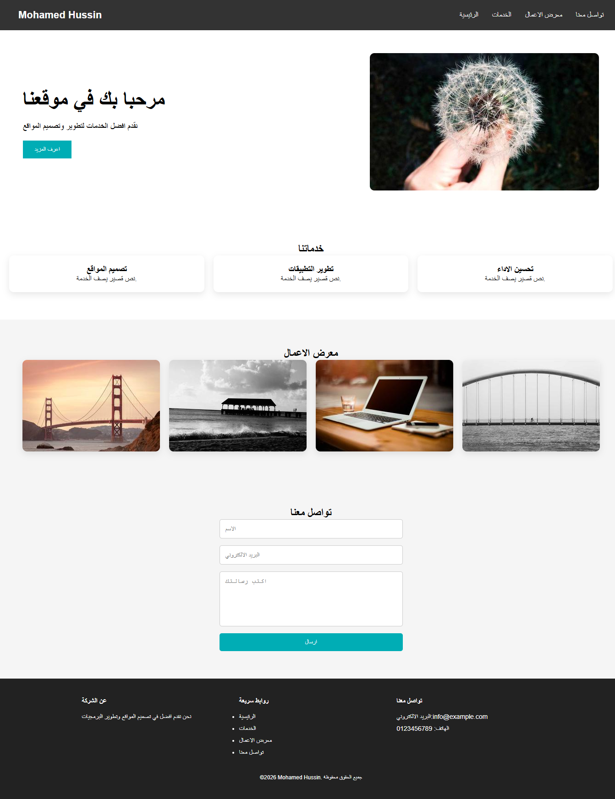

# 🌐 Landing Page Project

مشروع Front-End عبارة عن صفحة هبوط كاملة (Landing Page) باستخدام HTML و CSS.

المشروع يجمع معظم الخصائص الأساسية في CSS مثل Flexbox و Hover Effects و Responsive Design.

---

## 🚀 فكرة المشروع

الصفحة تتكون من عدة أقسام مثل مواقع الشركات:

- Navbar
- Hero Section
- Services Section
- Image Gallery
- Contact Form
- Footer

الهدف من المشروع هو دمج كل ما تم تعلمه في مشاريع CSS السابقة في صفحة واحدة.

---

## 🛠️ التقنيات المستخدمة

- HTML5
- CSS3
- Flexbox
- Media Queries
- Hover Effects

---

## 🎯 الخصائص المستخدمة في CSS

- margin
- padding
- box-sizing
- font-family
- display: flex
- flex-direction
- flex-wrap
- justify-content
- align-items
- gap
- width
- max-width
- border
- border-radius
- box-shadow
- background-color
- color
- text-align
- cursor
- transition
- transform
- hover
- position
- media query

---

## 🧠 ماذا تعلمت من المشروع؟

- إنشاء صفحة كاملة مكونة من عدة Sections
- استخدام Flexbox لتنظيم العناصر
- تصميم Navbar احترافي
- إنشاء Hero Section
- تصميم كروت الخدمات
- إنشاء Image Gallery مع تأثير Hover
- إنشاء Contact Form
- إنشاء Footer احترافي
- جعل الصفحة Responsive باستخدام Media Query

---

## 📂 هيكل المشروع
landing-page/
│── index.html
│── style.css
│── README.md

---

## 📷 صورة من المشروع

---

---

## ▶️ طريقة تشغيل المشروع

1. قم بتحميل المشروع.
2. افتح ملف `index.html` في المتصفح.
3. ستظهر صفحة Landing Page كاملة.

---

## 👨‍💻 المطور

Mohamed Hussin

---

⭐ هذا المشروع هو آخر مشروع في مرحلة تعلم أساسيات CSS.